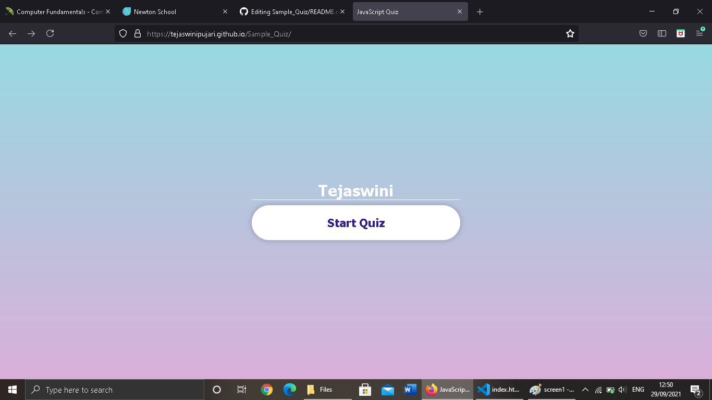
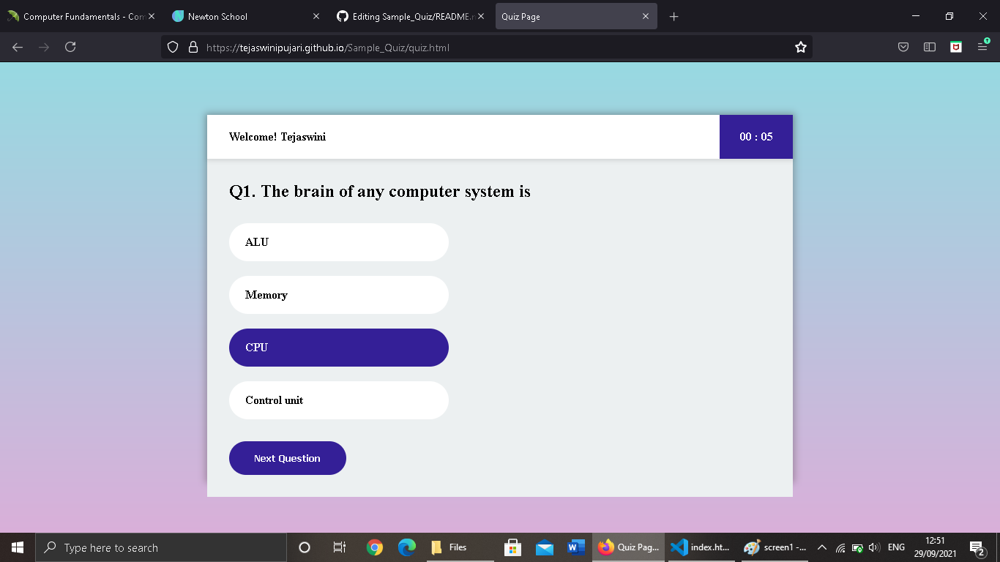
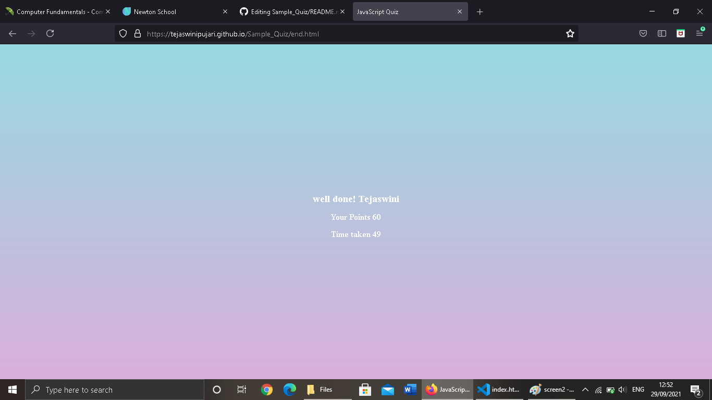

# Sample_Quiz

<h3>== Description ==</h3>

This is my Quiz Application.

 

The main goal of the application is to enable users to practice for subjective tests conducted for
  admissions and recruitment, with the focus on Computer Science field.

<h3>== Screenshots ==</h3>
<b>firstPage:</b>

   
<b>Quiz Strating Page:</b>

   
<b>Result Page:</b>

   
<h3>== Technology used ==<h3>
  <ul><b>
    <li>HTML</li>
    <li>CSS</li>
    <li>JavaScript</li></b>
  </ul>
<h3>== Website Link ==</h3>
"https://tejaswinipujari.github.io/Sample_Quiz/" 
"https://sample-quiz.vercel.app/"
   
   
 
<i>Copyright © 2021 | Tejaswini Pujari</i>

